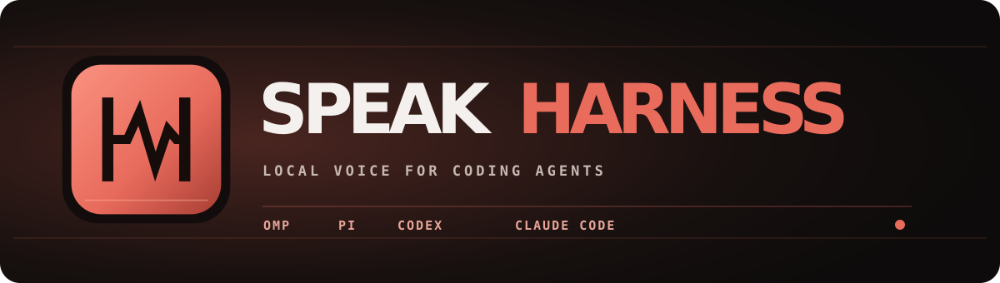
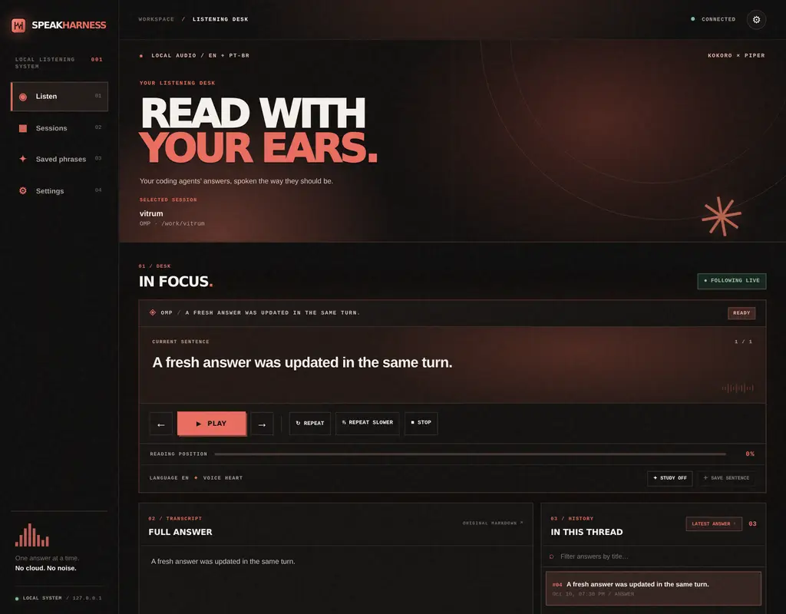
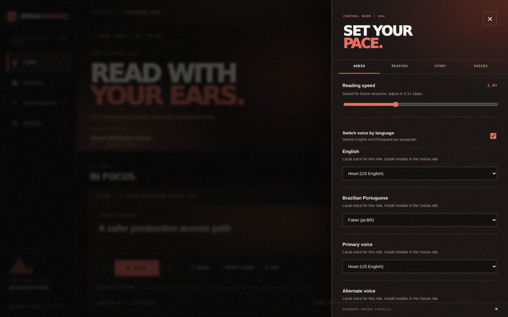

<p align="center">
  
</p>

<h1 align="center">Your coding agents write. SpeakHarness speaks.</h1>

<p align="center">
  A local voice companion for <strong>OMP, Pi, Codex and Claude Code</strong>.<br>
  Listen to their Markdown answers in English and Brazilian Portuguese, from a graphical dashboard or a terminal UI.
</p>

<p align="center">
  <a href="https://github.com/Matheuscara/speak-harness/actions/workflows/ci.yml"></a>
  <a href="https://github.com/Matheuscara/speak-harness/stargazers"></a>
  <a href="https://github.com/Matheuscara/speak-harness/issues"></a>
  
</p>

<p align="center">
  <a href="#quick-start">Quick start</a> · <a href="#what-it-does">Features</a> · <a href="#supported-harnesses">Harnesses</a> · <a href="#controls">Controls</a> · <a href="#privacy-and-security">Privacy</a>
</p>

---

<p align="center">
  
</p>
<p align="center"><sub>Actual local dashboard with a fictional example conversation; no personal transcript data.</sub></p>

## Why SpeakHarness?

Coding agents return long answers full of headings, links, tables and code. Sending that raw Markdown straight to a text-to-speech engine is exhausting to listen to. SpeakHarness turns the answer into a **speech script**, follows the original conversation, and lets you listen while you read or work.

- **Hear the answer, not the formatting.** It strips Markdown syntax, reads links by label and **announces code blocks instead of reciting code**.
- **Switch languages automatically.** English goes to local Kokoro; Brazilian Portuguese goes to local Piper. Detection runs per paragraph, not once for the entire answer.
- **Stay in your workflow.** Follow an already-open OMP, Pi, Codex or Claude Code session by reading its local transcript; no need to restart the harness.
- **Study by listening.** Repeat a sentence, slow it down, pause for shadowing and save useful phrases.
- **Choose your surface.** Use the graphical dashboard in your browser, the OpenTUI reader, a headless follower or a one-shot file reader.

The interface, controls and documentation are in English. This does not change the language of your transcripts: pt-BR text is still spoken in Portuguese.

## Quick start

### Nix (recommended on NixOS)

```sh
nix profile add github:Matheuscara/speak-harness/v0.1.6
speakh setup       # download the default local voices once
speakh web         # open the graphical dashboard
```

On Linux, the package also adds **SpeakHarness** (graphical dashboard) and **SpeakHarness Terminal** (OpenTUI in Alacritty) to the application menu. For a one-off run without installing: `nix run github:Matheuscara/speak-harness/v0.1.6 -- web`. Use the untagged `github:Matheuscara/speak-harness` flake only if you want the latest `main` instead of a pinned release.

### From source

Requires **Bun 1.3.14+**, **Node.js 22.18+** for the synthesis subprocess, and an audio player on your PATH (`pw-play`, `paplay`, `aplay`, `afplay` or `ffplay`).

```sh
git clone https://github.com/Matheuscara/speak-harness.git
cd speak-harness
bun install --frozen-lockfile
bun src/cli/main.ts setup
bun src/cli/main.ts web
```

On NixOS, use the Nix installation above: it supplies Bun, Node.js and the native library paths needed by ONNX Runtime. The initial downloads are approximately **305 MB for Kokoro q4** and **63 MB for Piper Faber**. Models are cached locally. **Settings → Voices** groups English and Brazilian Portuguese voices: preview installed voices in the browser, install missing models, then choose the voice for that language.

### Already running a harness?

Open the dashboard, go to **Sessions** and choose a conversation. **All** folders are shown by default; use **This folder** to narrow the list to the current project. Turn on **Read new answers automatically** under **Settings → Reading** if you want hands-free playback; it is off by default.

### Hear Oh My Pi replies without opening the dashboard

Install the OMP integration once and restart the OMP client so it loads the extension:

```sh
speakh integrate omp
speakh daemon
```

`speakh daemon` is the audio owner when no SpeakHarness interface is open. If `speakh web` or the TUI is already running, keep that one instance instead of starting a second audio owner. The extension sends only final assistant text through a local user-owned Unix socket; thinking, tool output and subagent replies are not spoken. A missing SpeakHarness instance never blocks the chat. Remove `~/.omp/agent/extensions/speak-harness.js` to uninstall the integration.

## What it does

| Capability | Behavior |
| --- | --- |
| Markdown-aware reading | Headings, lists, quotes, tables, links and inline identifiers become natural speech; fenced code is announced by language and line count. |
| Local bilingual voices | Kokoro for English, Piper for pt-BR; manual voice override is available. No cloud TTS or cloud language detection. |
| Live session following | Watches local transcripts and updates the listening page when new answers arrive. A lightweight activity check catches missed live events and indicates when the transcript changed before the next answer. Auto-read still skips thinking, tool results and in-between narration. |
| Graphical dashboard | All-folders session search by default, full Markdown transcript, searchable answer history with Latest, playback controls, voice previews and phrase collection. Served at `127.0.0.1` only. |
| OpenTUI | Keyboard-first reader with source-range highlighting, remappable shortcuts and a configurable settings screen. |
| Study mode | Sentence replay, slower repeat, optional shadowing pause and saved phrases. |

<p align="center">
  
</p>
<p align="center"><sub>Voices are grouped by language; previews play in your browser and models are installed locally.</sub></p>

## Supported harnesses

| Source | Existing session? | Reading quality |
| --- | --- | --- |
| Oh My Pi (OMP) | Yes | Native JSONL transcript; original Markdown and message boundaries. |
| Pi | Yes | Native JSONL transcript. |
| Codex | Yes | Native rollout transcript. |
| Claude Code | Yes | Native project transcript; split assistant blocks are merged. |
| Another CLI harness | Start it with `speakh run -- <command>` | Terminal capture fallback: visible text only, with heuristic message boundaries. |
| Markdown file or stdin | `speakh say answer.md` / `speakh say -` | Exact supplied text. |

The capture fallback **cannot attach to an unknown harness that was already running elsewhere**. Add a transcript adapter for that harness or launch it through `speakh run`.

## Controls

**Graphical dashboard:** use the left navigation to switch between Listen, Sessions, Saved phrases and Settings. Sessions starts at **All** folders; filter by harness, or choose **This folder**. Listen follows new answers without a manual reload; search the thread by answer title or press **Latest answer** to jump back to the newest one. Settings → Voices lets you hear installed voices, install missing ones and choose an English or pt-BR voice. Keyboard shortcuts on Listen include `Space` (play/pause), `←`/`→` (sentences), `r` (repeat), `a` (auto-read) and `s` (stop); `,` opens Settings, `/` opens Sessions and `Esc` returns to Listen from another page.

**Terminal UI:** run `speakh` inside the project directory. The session picker opens first; `Tab` switches between this folder and all folders, `1`–`5` filter harnesses, `/` searches and `a` reveals technical/empty sessions. In the reader, `Space` plays/pauses, `h`/`l` move between sentences, `r` repeats, `t` enables study mode, `p` saves a phrase, `,` opens settings and `?` shows the live keymap. Keys are remappable in the TUI or in the config file.

**Other modes:**

```sh
speakh follow                     # read new answers without an interface
speakh run -- omp                 # run OMP beside an embedded reader
speakh ctl replay-message        # control a running instance from tmux or a script
speakh voices list               # inspect voices and install status
speakh logs                      # recent local warnings and errors
```

In wrap mode, `Ctrl+G` followed by a key sends one reader command. `Ctrl+G →` keeps keyboard focus in the reader; `Esc` or `←` returns to the harness.

## Configuration

Settings are stored in `~/.config/speak-harness/config.toml` (or `$XDG_CONFIG_HOME/speak-harness/config.toml`). Changes made in the UI are saved and applied live. For example:

```toml
[voices]
primary = "kokoro:af_heart"
alternate = "kokoro:pf_dora"
auto_language = true
speed = 1.0

[voices.languages]
en = "kokoro:af_heart"
"pt-BR" = "piper:pt_BR-faber-medium"

[reading]
auto_read = false
tables = "summary"
```

Audio remains local. Saved study phrases live in `~/.local/share/speak-harness/phrases.md`; diagnostics live in `~/.local/state/speak-harness/speakh.log`.

## Privacy and security

SpeakHarness reads harness session files **without writing to them**. Synthesis, playback and language detection happen locally. The graphical UI binds only to `127.0.0.1`, uses a per-launch key and rejects foreign origins; its Markdown renderer does not execute raw HTML or load remote images. **Installing voice models** downloads those files from their upstream hosts; it does not upload your conversations. SpeakHarness has no hosted account or telemetry service.

## Status, contributing and license

SpeakHarness is an early public release. It has been exercised on **NixOS x86_64**; the flake also evaluates on Linux ARM64 and macOS ARM64, but those targets have not been run here. Transcript formats can change between harness versions. Please [open an issue](https://github.com/Matheuscara/speak-harness/issues) with a scrubbed sample if an adapter stops recognizing your sessions, or send a PR with a fixture and a behavioral test.

```sh
bun test
bunx tsc --noEmit -p .
```

Original SpeakHarness source is [MIT-licensed](LICENSE). The bundled `ephone` phonemizer is **GPL-3.0-or-later**; redistribution of the combined package must respect that license. Voice models carry their own terms; see [third-party notices](THIRD_PARTY_NOTICES). The project was informed by earlier work on `pi-speak`, but no `pi-speak` implementation was copied into this repository.

[Product plan](docs/PLAN.md) · [Technical design](docs/DESIGN.md) · [Releases](https://github.com/Matheuscara/speak-harness/releases)
