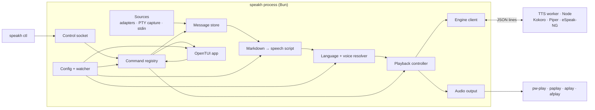
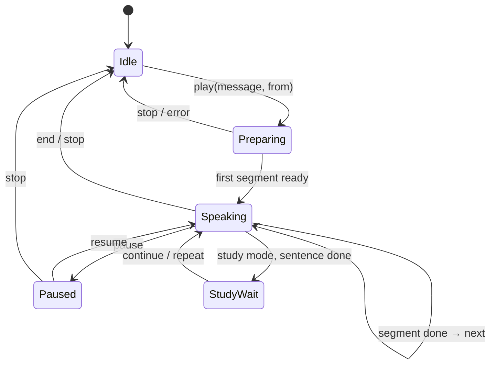

# SpeakHarness — technical design

Product plan: [PLAN.md](PLAN.md).

## Process model

One process runs the core: the TUI (`speakh`), wrap mode (`speakh run`), or headless follow (`speakh follow`). Whichever runs owns the audio queue and a control socket. `speakh ctl` is a thin client of that socket.



The TTS worker is a separate Node process because ONNX inference is CPU-bound and blocked the terminal UI when run in-process, and onnxruntime crashed inside a Bun worker thread (measured in the pi-speak work).

## Repository layout

Single package, strict module boundaries (split into workspaces only when a second consumer appears):

```text
src/
  cli/            entry points: tui, run, follow, say, ctl
  core/
    messages.ts   HarnessMessage, MessageStore
    speech/       markdown → SpeechScript, sentence split, lexicon
    language/     detection, voice resolution
    playback/     controller, queue, state machine
    commands.ts   command registry (single source for keys, ctl, palette)
    config/       schema, load, watch, write
  adapters/       omp, pi, codex, claude-code, (shared jsonl tail)
  capture/        PTY spawn + screen text extraction (wrap mode)
  engine/         client, worker (Node), engines (kokoro, piper), phonemizer, voice catalog
  audio/          player discovery, wav writing
  control/        unix socket server + client
  tui/            OpenTUI app, screens, keymap wiring
test/fixtures/    scrubbed transcripts, markdown samples
```

## Data model

```ts
type HarnessId = "omp" | "pi" | "codex" | "claude-code" | "capture" | "manual";

interface SessionRef { harness: HarnessId; id: string; cwd?: string; path?: string; updatedAt: Date }

interface HarnessMessage {
  key: string;              // harness:sessionId:messageId, stable; may repeat with updated text (treat as update)
  session: SessionRef;
  markdown: string;         // assistant text only
  createdAt: Date;
  final: boolean;           // false only while a captured message may still grow
  historical: boolean;      // existed when watching started
  commentary: boolean;      // narration alongside tool calls; skipped by auto-read and default selection
}

type SegmentKind = "heading" | "sentence" | "list-item" | "quote" | "cue" | "table";

interface SpeechSegment {
  text: string;             // what the engine speaks
  display: { start: number; end: number }; // offsets in message.markdown for highlight
  kind: SegmentKind;
  blockIndex: number;
  lang: "en" | "pt-BR";
  pauseAfterMs: number;
}

interface SpeechScript { messageKey: string; segments: SpeechSegment[]; blocks: number }
```

Every segment keeps its source range; the reader highlights by range, and navigation (`next-sentence`, `next-block`) moves over segments, not audio.

## Harness adapters

```ts
interface HarnessAdapter {
  id: HarnessId;
  sessions(filter: { cwd?: string }): Promise<SessionRef[]>;  // newest first
  watch(session: SessionRef, signal: AbortSignal): AsyncIterable<HarnessMessage>;
}
```

Shared `JsonlTail`: opens the file, reads from a byte offset, buffers partial lines, follows appends with `fs.watch` plus a poll fallback, and restarts on truncation or replacement. Adapters only map parsed lines to messages.

| Adapter | Sessions | Assistant text | Final when |
| --- | --- | --- | --- |
| omp | `~/.omp/agent/sessions/<dir>/<ts>_<id>.jsonl`; line 1 `type:"title"` (rewritten in place), line 2 `type:"session"` with `id`, `cwd`, `title` | `type:"message"`, `message.role:"assistant"`, `content[type=text].text`; commentary when content has a `toolCall` | line written |
| pi | `~/.pi/agent/sessions/--<abs-path>--/*.jsonl`; header line; title from latest `session_info.name` | same as omp | line written |
| codex | `~/.codex/sessions/YYYY/MM/DD/rollout-*.jsonl`; `session_meta` with `payload.id`, `payload.cwd` | `response_item` with `payload.type:"message"`, `role:"assistant"`, `content[type=output_text].text`; commentary when `phase:"commentary"`; `event_msg` duplicates ignored | line written |
| claude-code | `~/.claude/projects/<encoded-cwd>/<sessionId>.jsonl`; `cwd`/`sessionId` on every line; title from latest `ai-title` | `type:"assistant"` lines sharing `message.id` are merged (one content block per line); commentary when any block is `tool_use`; sidechain and API-error lines excluded | next unrelated line, or 2 s quiet |

Selection: sessions whose cwd matches the current directory, most recently updated first; `switch-session` lists all. cwd comes from transcript metadata, never from directory names (their encodings vary across versions). Subagent transcripts are skipped.

Rules:

- Read-only. Never write to harness files.
- Unknown fields and lines are ignored; a broken line never stops the tail.
- One adapter failing shows a warning in the status line and does not affect others.
- Thinking blocks, tool calls, and tool results are excluded.
- Each adapter has fixture tests built from real transcripts with content scrubbed.

### Capture (wrap mode)

`Bun.spawn(cmd, { terminal })` runs the harness in a PTY; its output feeds OpenTUI's `EmbeddedTerminalRenderable`. Keys go to the PTY except after the prefix key. Message boundaries in capture are heuristic (text appearing after the last user input until the screen is idle for N ms), so wrap mode prefers a real adapter when the wrapped command is recognized and uses capture only as a fallback.

## Markdown → speech script

1. Parse with `mdast-util-from-markdown` + GFM (tables, strikethrough, autolinks), keeping positions.
2. Walk blocks; each block becomes one or more segments:

| Node | Output |
| --- | --- |
| heading | one `heading` segment, pause 600 ms |
| paragraph | sentences (`Intl.Segmenter` with granularity `sentence`, locale of the block) |
| list / listItem | item text as `list-item`, pause 250 ms; ordered lists prefix the number |
| code (fenced) | `cue`: "{lang} code block, {n} lines" / "bloco de código {lang}, {n} linhas"; no language → "code block" |
| inlineCode | split identifiers (`camelCase`, `snake_case`, `kebab-case`, dots); > 40 chars or symbol-heavy → "code" |
| link | label; autolink/bare URL → host without `www.` |
| file path in text | last segment ("src/core/speech.ts" → "speech.ts") |
| table | `table` summary: columns count and header names; rows on `read-table` |
| blockquote | children with a "quote" cue, configurable |
| emphasis, strong, delete | children text |
| html, image | alt text or dropped |
| thematicBreak | pause 600 ms |

3. Normalize: drop emoji and decorative symbols, collapse whitespace, apply the lexicon (case-sensitive whole-word entries per language: `TTL` → `T T L`, `SQL` → `S Q L`, `JSON` → `jason`, `e.g.` → `for example`, `ex.` → `por exemplo`).
4. Segments longer than the engine's comfortable size (≈240 chars) are split at clause boundaries, then word boundaries.

Code-block cues are spoken in the language of the surrounding text. The `code_blocks` setting exists only to change the cue wording; reading code is not offered.

## Language and voice

Detection runs per block, not per message:

1. Candidate languages: the configured voices' languages (v1: `en`, `pt-BR`).
2. Score block text (lexicon-normalized, without inline code) with `franc-min` restricted to `eng`/`por`, `minLength` 20.
3. Undetermined or short blocks inherit the previous block's language; the first block inherits the message's dominant language (detected on the whole text).
4. Hysteresis: a block switches language only if the score gap clears a threshold, so one English term inside Portuguese does not flip the voice.

Voice resolution: `voiceOverride` (from `voice-primary`/`voice-alternate`) → language map in config → primary voice. Voices are addressed as `engine:voice` (`kokoro:af_heart`, `piper:pt_BR-faber-medium`), so one message can mix engines per paragraph.

## Speech engines

Engines are interchangeable behind one interface and run inside the TTS worker. The app side only knows voice ids.

```ts
interface VoiceInfo {
  id: string;               // "piper:pt_BR-faber-medium"
  engine: "kokoro" | "piper";
  lang: "en" | "pt-BR";
  label: string;
  sizeBytes: number;
  installed: boolean;
  license: string;          // model/dataset license shown before download
}

interface SpeechEngine {
  id: VoiceInfo["engine"];
  voices(): VoiceInfo[];
  install(voice: string, onProgress: (done: number, total: number) => void): Promise<void>;
  synthesize(req: { text: string; voice: string; lang: string; speed: number }, signal: AbortSignal):
    Promise<{ sampleRate: number; pcm: Float32Array }>;
}
```

### Defaults (v1)

| Language | Default | Alternatives |
| --- | --- | --- |
| en | `kokoro:af_heart` | other Kokoro English voices; Piper English voices work through the same path |
| pt-BR | `piper:pt_BR-faber-medium` | `piper:pt_BR-cadu-medium`, `piper:pt_BR-jeff-medium`, `kokoro:pf_dora`, `kokoro:pm_alex` |

Kokoro stays the English default for quality. Piper is the pt-BR default: its voices are trained on Brazilian Portuguese datasets, and it synthesizes ~8× faster than Kokoro on pt-BR (measurement below). The pt-BR default is confirmed by a listening test with the user before M1 ships.

### Shared phonemizer

One `ephone` instance (eSpeak-NG 1.52 compiled to WASM) in the worker, loaded lazily per language pack. Both engines consume its IPA:

- Kokoro English uses kokoro-js's own phonemizer (`generate`).
- Kokoro pt-BR: `ephone` IPA → Kokoro tokenizer → `generate_from_ids`.
- Piper (any language): `ephone` IPA → Piper phoneme ids.

`ephone` output for pt-BR matched system `espeak-ng 1.52` on the test sentence except for palatalization marks (`siʲ`), which Piper's id map does not depend on. `textToIpaWithSourceMap` also maps IPA back to source text, which enables word-level highlight later.

### Piper engine

Implemented from the model format, without Piper's GPL runtime or Python:

1. Phonemize one sentence; keep the clause terminator (`,` `.` `?` `!`).
2. NFD-decompose to codepoints; ids = `^ _` + (`id(p) _` for each phoneme) + `$` using the voice's `phoneme_id_map`. Unknown phonemes are dropped and reported once.
3. ONNX inputs: `input` int64 `[1, n]`, `input_lengths` `[n]`, `scales` float32 `[noise_scale, length_scale / speed, noise_w]` from the voice config; `sid` only for multi-speaker voices.
4. Output float audio at the voice's sample rate (22.05 kHz for medium), peak-normalized.

Voices are downloaded on demand from `rhasspy/piper-voices` on Hugging Face into `$XDG_CACHE_HOME/speak-harness/piper/` (`.onnx` + `.onnx.json`, ~63 MB each), with size and license shown first. Sessions are created lazily per voice and kept while used.

### Kokoro engine

kokoro-js, model `onnx-community/Kokoro-82M-v1.0-ONNX` q4 on CPU (`model_q4.onnx`, ~305 MB; the q8 `model_quantized.onnx` is ~92 MB), downloaded once into `$XDG_CACHE_HOME/speak-harness/kokoro`. English through `generate`; pt-BR through the shared phonemizer and `generate_from_ids`.

### Measured (M0 latency spike, done)

Node 22 worker, CPU, three pt-BR sentences of 85–90 characters (~5 s of audio each):

| Voice | Model load | Synthesis per sentence | Real-time factor |
| --- | --- | --- | --- |
| `piper:pt_BR-faber-medium` | 1.0 s | 227–273 ms | ~0.05 |
| `piper:pt_BR-cadu-medium` | 0.7 s | 255–301 ms | ~0.05 |
| `piper:pt_BR-jeff-medium` | 0.7 s | 256–325 ms | ~0.05 |
| `kokoro:pf_dora` | 0.9 s | 2053–2129 ms | ~0.40 |
| `kokoro:pm_alex` | 0.9 s | 1982–2201 ms | ~0.40 |

No phonemes were missing from any Piper id map. `ephone` loads in 0.15 s.

### Worker protocol

Bun ↔ Node worker over stdio JSON lines (audio as base64 float32; fine for mono speech chunks):

```text
→ {"id":1,"op":"voices"}
← {"id":1,"ok":true,"voices":[…]}
→ {"id":2,"op":"install","voice":"piper:pt_BR-faber-medium"}
← {"id":2,"progress":[31457280,63201294]}
← {"id":2,"ok":true}
→ {"id":3,"op":"synthesize","text":"…","voice":"piper:pt_BR-faber-medium","lang":"pt-BR","speed":1.0}
← {"id":3,"ok":true,"sampleRate":22050,"pcm":"<base64 f32>"}
→ {"id":4,"op":"cancel","target":3}
```

- Each audio chunk carries its own sample rate; playback writes one WAV per chunk, so mixed 24 kHz (Kokoro) and 22.05 kHz (Piper) segments need no resampling.
- Worker crash → pending requests fail with a visible error; next request restarts the worker.

### Licenses

| Component | License |
| --- | --- |
| kokoro-js, Kokoro-82M weights | Apache-2.0 |
| onnxruntime-node | MIT |
| `ephone` (eSpeak-NG) | GPL-3.0-or-later |
| Piper pt-BR voices faber, cadu, jeff | datasets CC0 (model cards) |
| Piper runtime (`piper1-gpl`) | GPL-3.0 — not used; only the model format is implemented |

SpeakHarness code stays MIT. Distributions that include the worker with `ephone` are covered by GPL-3.0 as a combined work; the README states this.

## Playback controller



- Look-ahead: synthesize up to 2 segments ahead of the one playing; navigation cancels outdated work.
- Pause stops the player process and remembers the segment; resume restarts that segment (simple and reliable over player-specific seeking).
- Auto-read: a new final message starts playback only when Idle; otherwise it is queued (newest wins, configurable).
- `repeat-slower` re-synthesizes the current segment at `speed × 0.75`.

## Commands

A registry is the single source of truth:

```ts
interface Command { id: string; title: string; group: string; run(ctx: CommandContext, args?: string[]): Promise<void> }
```

- `@opentui/keymap` binds keys to command ids (`registerDefaultKeys`, leader, sequence disambiguation, conflict diagnostics, cheat-sheet helpers).
- Command palette lists the registry.
- Control socket runs the same ids: `speakh ctl replay-message`.

## Control socket

Unix socket at `$XDG_RUNTIME_DIR/speak-harness/<pid>.sock` plus a `current` symlink. Newline-delimited JSON: `{"command":"replay-message"}` → `{"ok":true}`. Local user only (socket file mode 0600). Example tmux binding:

```text
bind-key S run-shell "speakh ctl replay-message"
```

The OMP/Pi extension bridge is a few lines calling the same socket from a harness shortcut.

## Config

`~/.config/speak-harness/config.toml`, watched and hot-reloaded; invalid edits keep the last valid config and show the error.

```toml
[voices]
primary = "kokoro:af_heart"
alternate = "kokoro:pf_dora"
auto_language = true
speed = 1.0

[voices.languages]
en = "kokoro:af_heart"
"pt-BR" = "piper:pt_BR-faber-medium"

[reading]
auto_read = false
code_block_cue = "announce"     # announce only; wording is localized
tables = "summary"              # summary | rows
quote_cue = true

[study]
pause_after_sentence = false
shadowing = false
slower_speed = 0.75

[keys]
leader = "\\"
play-pause = ["space"]
replay-message = ["ctrl+r"]
next-block = ["shift+l"]   # uppercase letters must be written as shift+<key>
save-phrase = ["p"]
quit = []                  # an empty list unbinds

[wrap]
prefix = "ctrl+g"

[lexicon.en]
TTL = "T T L"
```

## TUI composition (OpenTUI)

- `Reader`: `ScrollBoxRenderable` of block renderables rendered from mdast (GFM) into `TextRenderable` chunks; every visible character keeps its markdown offset, so speech `display` ranges map 1:1 to highlighted text. `MarkdownRenderable` was rejected: it parses with `marked`, keeps no source positions, and cannot style a range. Code blocks are framed and syntax-colored (bundled ts/js/zig parsers) but never spoken.
- `StatusLine`, `MessagesList` (`SelectRenderable`), `SessionPicker`, `Settings` (form of `Select`, `Input`, `Slider`), `KeymapEditor`, `Help` (from keymap extras), `Phrases`.
- Wrap mode: horizontal split, `EmbeddedTerminalRenderable` (harness) + `Reader`.
- Tests with OpenTUI's in-memory test renderer: screens render, commands dispatch, highlight follows playback events.

## Testing strategy

| Layer | Tests |
| --- | --- |
| Speech script | Golden tests: markdown fixture → segments (text, kind, lang, range) |
| Language | Table tests: EN, PT, mixed, short, technical terms; hysteresis cases |
| Adapters | Real scrubbed JSONL fixtures; partial lines; truncation; unknown fields |
| Playback | State-machine tests with a fake engine and fake player (cancel, pause, look-ahead) |
| Commands/keymap | Every default binding resolves; conflicts detected; ctl dispatch |
| TUI | In-memory renderer snapshots and interaction tests |
| Engines | Piper phoneme→id golden tests against a real voice config; voice-id resolution across engines; manual smoke script (real models, real audio) per release |

## Spikes before building (M0)

1. **Highlight**: done — OpenTUI's markdown component cannot style source ranges; the reader renders mdast itself (see TUI composition).
2. **Wrap mode**: `Bun.spawn` with `terminal` + `EmbeddedTerminalRenderable`: input passthrough, resize, prefix key.
3. **Latency**: done; see "Measured" under Speech engines. Remaining: listening test for the pt-BR default.

## Risks

| Risk | Mitigation |
| --- | --- |
| Harness transcript formats change | Small adapters, fixtures, failure isolation |
| Short / mixed-language text misdetected | Block-level detection, inheritance, hysteresis, manual override |
| pt-BR quality depends on eSpeak-NG phonemes | Two pt-BR engines, user lexicon for technical terms, listening test before defaults ship |
| Piper project maintenance (seeking maintainers) | Only the stable ONNX model format is used; models are cached locally |
| OpenTUI requires Bun ≥ 1.3.14 (Node needs ≥ 26 + FFI) | Ship with Bun; Nix flake pins it |
| Capture boundaries are heuristic | Capture only as fallback; adapters first |
