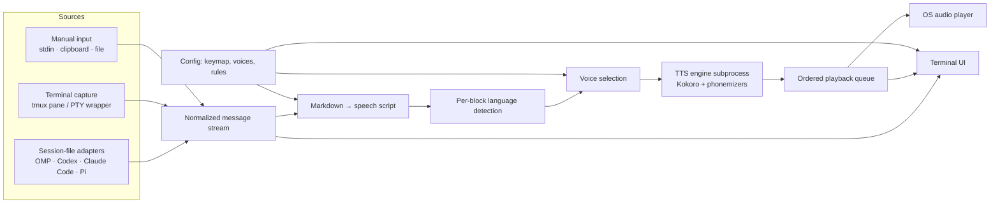

# SpeakHarness — project plan

## Goal

A terminal app that reads the responses of any AI coding harness aloud, in the right voice for the language, without reading markdown syntax literally. It runs next to the harness (for example in a tmux split), shows the response being read, and lets the user configure keymaps, voices, and reading rules.

## User experience

```text
┌──────────────── harness (OMP, Codex, Claude Code…) ─────────────┐┌──────── SpeakHarness ─────────┐
│ > explain the TTL change                                        ││ ● omp  ~/developer/vitrum      │
│                                                                 ││ ──────────────────────────────│
│ ## What is this task about?                                     ││ What is this task about?      │
│ Developers use the **application's database user**…             ││ ▶ Developers use the          │
│ - **Temporary:** the credential has a TTL                       ││   application's database user │
│                                                                 ││ ──────────────────────────────│
│                                                                 ││ en · af_heart · 1.0x · 2/7    │
└─────────────────────────────────────────────────────────────────┘└───────────────────────────────┘
```

- Detects the harness session that is active in the current directory and follows new assistant responses.
- Auto-read mode (optional) or read on demand.
- Shows the rendered response with the sentence currently being spoken highlighted.
- Keys work while the SpeakHarness pane is focused; harness-side shortcuts come from optional bridges (see "Keymaps").

## Architecture



### 1. Harness sources (how "any harness" works)

"Any harness" is handled in three tiers, best fidelity first:

| Tier | How it reads | Fidelity | Notes |
| --- | --- | --- | --- |
| Session-file adapter | Tails the harness's JSONL transcript | Exact markdown, message boundaries, roles | One small adapter per harness |
| Terminal capture | Reads a tmux pane / wraps the harness in a PTY | Rendered text only, no reliable boundaries | Works with unknown harnesses |
| Manual input | `stdin`, clipboard, file | Whatever the user gives | Always available |

Adapter contract:

```ts
interface HarnessAdapter {
  id: string;                                   // "omp", "codex", "claude-code"
  detect(cwd: string): Promise<SessionRef[]>;   // sessions for this project, newest first
  watch(session: SessionRef): AsyncIterable<HarnessMessage>;
}

interface HarnessMessage {
  id: string;
  role: "assistant" | "user";
  markdown: string;        // text blocks only; tool calls, thinking, and tool output excluded
  createdAt: Date;
  final: boolean;          // false while the harness is still streaming
}
```

Initial adapters, based on local transcripts:

| Harness | Location | Assistant text |
| --- | --- | --- |
| OMP | `~/.omp/agent/sessions/<project>/*.jsonl` | `type: "message"`, `message.role: "assistant"`, `content[].type: "text"` |
| Codex | `~/.codex/sessions/YYYY/MM/DD/rollout-*.jsonl` | `type: "response_item"`, `payload.role: "assistant"`, `content[].type: "output_text"` |
| Claude Code | `~/.claude/projects/<project>/*.jsonl` | `type: "assistant"`, `message.content[].type: "text"` (to verify against a transcript containing assistant messages) |
| Pi | `~/.pi/agent/sessions/…` | Same shape as OMP (to verify) |

Rules: adapters are read-only, tolerate unknown fields and partial lines, and fail per adapter without stopping the app. Formats change; each adapter gets fixture-based tests from real (scrubbed) transcripts.

### 2. Markdown → speech script

The response is parsed as markdown (mdast) and converted to a speech script: a list of spoken segments with pauses and a pointer back to the source text for highlighting.

| Markdown | Spoken as (default) | Configurable |
| --- | --- | --- |
| Heading | Its text, followed by a longer pause | Announce level: off |
| Paragraph | Sentences | — |
| Bold / italic / strikethrough | Plain text | — |
| Bulleted list | Each item, short pause between | Announce count ("three items") |
| Numbered list | "First… second…" or numbers | Style |
| Inline code | Its text, identifiers split (`camelCase` → "camel case") | Spell symbols |
| Fenced code block | "Code block, TypeScript, 12 lines" | Skip / announce / read |
| Link | Label only | Read URL domain |
| Bare URL / file path | Domain or last path segment | Full |
| Table | "Table with 3 columns and 5 rows", then header names | Read rows |
| Blockquote | Text with a "quote" cue | Cue off |
| Emoji, decorative symbols | Dropped | Keep |
| Abbreviations (`TTL`, `SQL`, `e.g.`) | Expanded through a per-language dictionary | User dictionary |

Mixed-language responses are common (Portuguese explanation with English terms, or English text quoting Portuguese). Language is detected per block (paragraph, list item, heading); short blocks inherit the language of their neighbours. This fixes cases such as reading "TTL" inside a Portuguese answer.

### 3. Speech engine

- Kokoro-82M (local, Apache-2.0) in a Node subprocess so inference never blocks the UI — already proven in the `pi-speak` work.
- English: Kokoro's built-in phonemizer. Brazilian Portuguese: eSpeak-NG (`ephone`, `pt-BR`) → `generate_from_ids`, voices `pf_dora`, `pm_alex`, `pm_santa`.
- Engine interface (`synthesize(segment, voice, speed) → PCM`) so other local engines (for example Piper) can be added later.
- Chunked synthesis: the first segment plays while the next ones are synthesized; stop/skip cancels pending work.
- Audio output through `pw-play` / `paplay` / `aplay` / `afplay` discovered on `PATH` (NixOS-safe).

### 4. Terminal UI

Panes: session header (harness, project, live/idle), rendered response with current-sentence highlight, message history list, status line (language, voice, speed, position).

Default keymap (all remappable):

| Action | Key |
| --- | --- |
| Play / pause | `space` |
| Stop | `s` |
| Next / previous sentence | `l` / `h` |
| Next / previous paragraph | `L` / `H` |
| Replay current response | `r` |
| Read previous / next response | `k` / `j` |
| Toggle auto-read | `a` |
| Force voice: primary / alternate / auto | `1` / `2` / `0` |
| Speed down / up | `-` / `+` |
| Switch session or harness | `tab` |
| Settings | `,` |
| Help | `?` |
| Quit | `q` |

### Keymaps

- Config file `~/.config/speak-harness/config.toml`, editable from the settings screen; validation reports unknown actions and conflicting keys.
- Keys reach SpeakHarness only while its pane is focused. To trigger reading from inside the harness, the plan adds optional bridges in this order:
  1. A local control socket (`speakh ctl play|stop|replay`) that anything can call — tmux bindings, shell aliases, harness hooks.
  2. Per-harness shortcut bridges where the harness supports extensions (OMP/Pi extension calling the socket).
  3. OS-level global hotkeys later, if still needed.

Example:

```toml
[keys]
play_pause = "space"
replay = "r"
voice_alternate = "2"

[voices]
primary = "af_heart"
alternate = "pf_dora"
auto_language = true
speed = 1.0

[reading]
code_blocks = "announce"   # skip | announce | read
tables = "summary"         # summary | rows
auto_read = false
```

## Stack

- TypeScript on Bun (single binary via `bun build --compile` later); Node subprocess for the TTS engine.
- Markdown: `mdast-util-from-markdown` + GFM extension.
- Language detection: `franc-min`, restricted to configured languages, with a minimum length and neighbour inheritance.
- TUI library: open decision (see below).
- Packaging: npm + Nix flake.

## Milestones

| Milestone | Delivers | Done when |
| --- | --- | --- |
| M0 — Core | Speech script from markdown, per-block language detection, engine subprocess, playback queue; `speakh say file.md` | A long mixed EN/PT markdown file is read with correct voices, without markdown noise |
| M1 — Adapters | OMP, Codex, Claude Code session watchers + fixtures; `speakh follow` (headless) | New assistant responses from each harness are spoken as they finish |
| M2 — TUI | Rendered response, highlight, history, keymap and settings | All default actions work and are remappable from config |
| M3 — Control bridge | Control socket, tmux example bindings, OMP extension bridge | Reading can be triggered from inside the harness |
| M4 — Fallback capture | tmux pane / PTY capture for unknown harnesses | Reads a harness with no adapter, with acceptable boundaries |
| M5 — Distribution | Nix flake, npm package, docs | Clean install on NixOS and a non-Nix Linux |

## Risks

- **Transcript formats change** — mitigated by small adapters, fixtures, and per-adapter failure isolation.
- **Streaming responses** — speak only finished messages by default; partial reading is a later option.
- **Short or mixed-language text** — neighbour inheritance and a primary-voice fallback; manual override always available.
- **Kokoro JS multilingual support** — pt-BR relies on our own phonemization path, not upstream `kokoro-js`.
- **Terminal capture quality** — fallback tier only; never the primary path.

## Open decisions

1. TUI library: Ink (React, mature) vs. OpenTUI (newer, faster rendering) vs. a minimal custom renderer.
2. Default code-block behaviour: announce (recommended) or skip.
3. License: MIT (matches `pi-speak`, whose MIT notice must be kept for any reused code).
4. Domain: `speakharness.com` had no registration in RDAP at planning time; not purchased.
